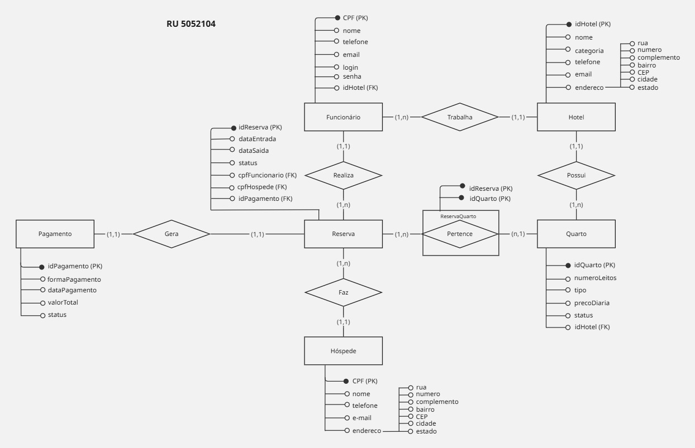

# Rede de Hotéis — Modelagem Conceitual de Banco de Dados

> Projeto de **Banco de Dados** — UNINTER  
> Curso: Análise e Desenvolvimento de Sistemas · 2025

---

## Sobre o Projeto

A partir de [regras de negócio](docs/business-rules.md) fornecidas para uma **Rede de Hotéis**, foi elaborado o **Modelo Entidade-Relacionamento (MER)** — etapa de modelagem conceitual do banco de dados.

O MER contempla entidades, atributos, relacionamentos, cardinalidades, chaves primárias e chaves estrangeiras. A modelagem respeitou estritamente as regras de negócio fornecidas, sem criar entidades ou atributos além do especificado.

---

## Entidades

| Entidade      | Chave Primária           | Descrição                                         |
| ------------- | ------------------------ | ------------------------------------------------- |
| Hotel         | `idHotel`                | Unidades da rede com endereço completo            |
| Funcionário   | `CPF`                    | Colaboradores vinculados a um hotel               |
| Quarto        | `idQuarto`               | Quartos pertencentes a um hotel                   |
| Hóspede       | `CPF`                    | Clientes que realizam reservas                    |
| Reserva       | `idReserva`              | Reservas com datas e status                       |
| Pagamento     | `idPagamento`            | Pagamentos gerados pelas reservas                 |
| ReservaQuarto | `idReserva` + `idQuarto` | Entidade associativa (N:N entre Reserva e Quarto) |

---

## Relacionamentos e Cardinalidades

| Relacionamento | Entidades             |      Cardinalidade      |
| -------------- | --------------------- | :---------------------: |
| Trabalha       | Funcionário → Hotel   |           N:1           |
| Realiza        | Funcionário → Reserva |           1:N           |
| Possui         | Hotel → Quarto        |           1:N           |
| Pertence       | Reserva ↔ Quarto      | N:N (via ReservaQuarto) |
| Faz            | Hóspede → Reserva     |           1:N           |
| Gera           | Reserva → Pagamento   |           1:1           |

---

## Modelo Entidade-Relacionamento

_Modelo criado usando a ferramenta [Miro](https://miro.com/app/board/uXjVIj6jl0g=/?share_link_id=812267939032)_

---

## Documentação

| Documento                                   | Descrição                             |
| ------------------------------------------- | ------------------------------------- |
| [Regras de Negócio](docs/business-rules.md) | Requisitos que orientaram a modelagem |

---

## 👩‍💻 Autora

**Giselle S.**  
Análise e Desenvolvimento de Sistemas — UNINTER · 2025

---

## Conceitos explorados

Este projeto documenta os seguintes conceitos de modelagem de banco de dados na pasta [`concepts/`](concepts/):

| Conceito                                                           | Descrição resumida                                                                    |
| ------------------------------------------------------------------ | ------------------------------------------------------------------------------------- |
| [Entity-Relationship Model](concepts/entity-relationship-model.md) | Representação abstrata de entidades, atributos e relacionamentos do domínio           |
| [Cardinality](concepts/cardinality.md)                             | Quantas instâncias de uma entidade se relacionam com outra — define onde ficam as FKs |
| [Primary and Foreign Keys](concepts/primary-and-foreign-keys.md)   | Mecanismos de unicidade e integridade referencial entre tabelas                       |
| [Associative Entity](concepts/associative-entity.md)               | Entidade intermediária criada para resolver relacionamentos N:N                       |
| [Composite Attributes](concepts/composite-attributes.md)           | Atributos decompostos em sub-atributos com significado próprio, como endereço         |

> Os arquivos de conceito contêm explicações detalhadas e exemplos extraídos diretamente da modelagem.
